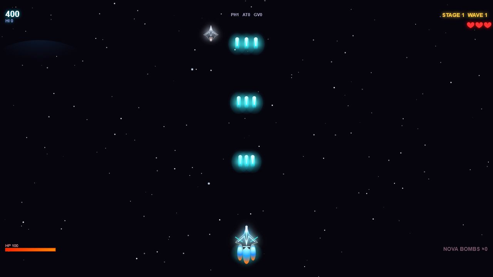

# Kytherion Drift

Status: playable single-file browser game. Public demo: https://policani.net/kytherion-drift/

Kytherion Drift is a fast canvas arcade shooter with exotic weapon pickups, boss waves, touch controls, keyboard movement, particle-heavy combat, and a 16:9 starfield playfield. It runs entirely in the browser from one HTML file.

## How To Evaluate

- Play the hosted demo at https://policani.net/kytherion-drift/.
- Open `index.html` locally to run the same self-contained build without a server.
- Use Arrow Keys or WASD to move.
- Press `B` for Nova Bomb.
- Tap or click the game canvas to start on desktop or mobile.

## What Is Included

- `index.html`: the public, self-contained game build.
- `kytherion-drift.html`: the original local build preserved for reference.
- No package install, backend, account, or network dependency.

## Public Portfolio Fit

This is a "just for fun" side project, not an executive portfolio proof claim. It is useful as a small inspectable example of directing an interactive browser artifact end to end with AI tools.

## License

MIT. See `LICENSE.md`.
